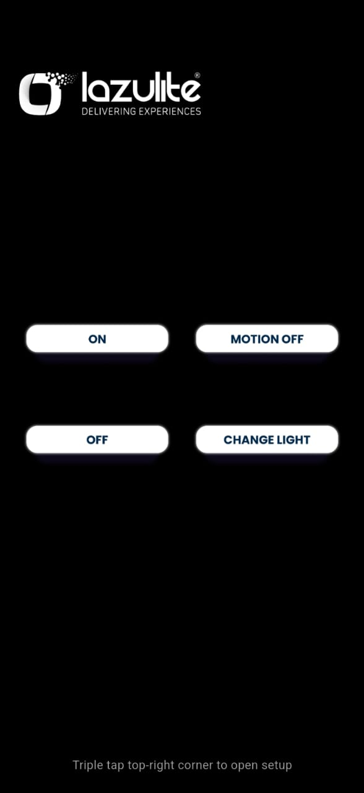
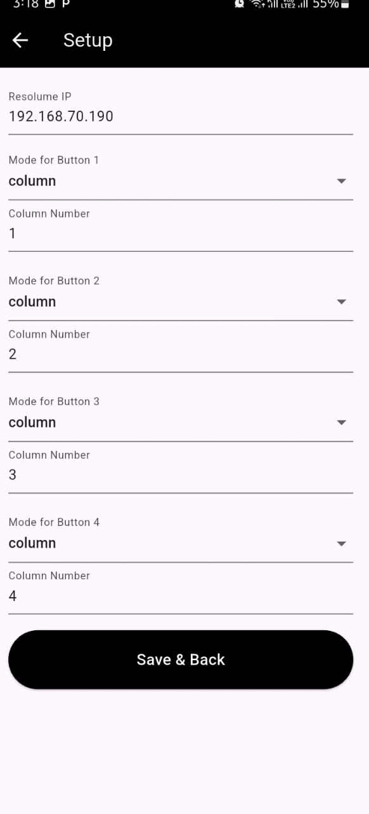

# Resolume Trigger App

A mobile controller built with Flutter that sends OSC messages to Resolume Arena over Wi-Fi. Designed for VJs, performers, and visual artists to trigger columns and specific clips/layers with ease.

## 🎯 Features

- Trigger Resolume Arena clips using customizable buttons
- Two control modes: Column Mode & Layer+Clip Mode
- WebSocket connection to OSC Python server
- Persistent settings using SharedPreferences
- PDF summary export for usage logs (if needed)
- Responsive mobile UI

## 📱 Built With

- **Flutter** – for cross-platform mobile development
- **WebSocket** – to send OSC commands via a bridge server
- **Python (optional)** – as a backend OSC relay (if used)

## 🚀 Getting Started

1. Clone the repo  
   `git clone https://github.com/yourusername/resolume-trigger-app.git`

2. Navigate into project  
   `cd resolume-trigger-app`

3. Install dependencies  
   `flutter pub get`

4. Run the app  
   `flutter run`

## 📱 App UI

Here’s a preview of the Resolume Trigger App in action:

## 📡 How it Works

- The app connects to a WebSocket server running on your local machine or a LAN device.
- When buttons are pressed, it sends OSC messages like `/layer1/clip1/connect` to Resolume Arena.

## 🔧 Optional: Python OSC Relay Server

If you’re using WebSocket → OSC relay, setup your Python server using [python-osc](https://pypi.org/project/python-osc/).

## 🧾 License

This project is licensed under the MIT License.
